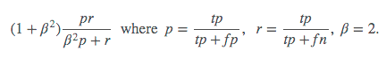

# Planet: Understanding the Amazon from Space

## Use satellite data to track the human footprint in the Amazon rainforest

### Training on resnet50 with dataset(by https://www.planet.com/): https://www.kaggle.com/c/planet-understanding-the-amazon-from-space/data

#### Submission to Kaggle

Evaluated based on their mean (F_{2}) score. The F score, commonly used in information retrieval, measures accuracy using the precision p and recall r. Precision is the ratio of true positives (tp) to all predicted positives (tp + fp). Recall is the ratio of true positives to all actual positives (tp + fn). The (F_{2}) score is given by

* First Try:
Transforming image to size=128 was giving f_{2} score of 0.924815
Tranforming 

* Second Try:
Transforming images to size=256 gave use f_{2} score of 0.928..

Top 6% out of 923 teams